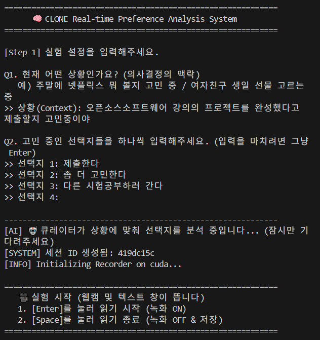
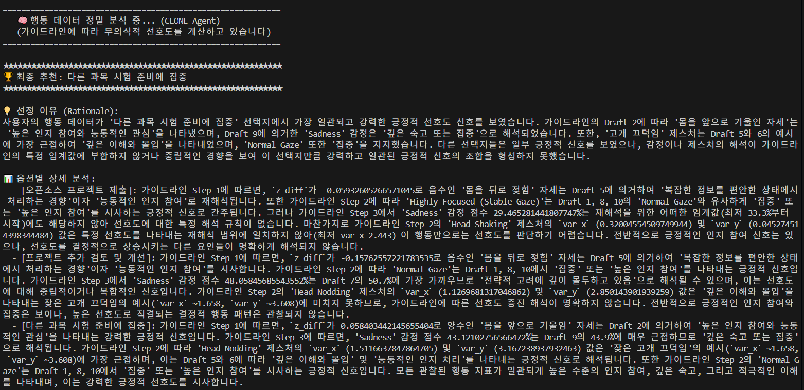

# 🧠 CLONE: 행동 기반 무의식 선호도 분석 시스템
> **Behavior-based Subconscious Preference Analysis System**
>
> *"당신이 확신하지 못 하는 선택지, 당신의 동공과 자세로 골라봅시다."*

<div align="center">

[](https://www.python.org/)
[](https://aistudio.google.com/)
[](https://opencv.org/)
[](LICENSE)


</div>

## 📺 프로젝트 시연 (Demo)

**CLONE framework 기법을 적용한 LLM 시스템**이 사용자의 상황을 분석하고, 시선과 자세를 추적하여 최적의 선택지를 추천하는 전체 과정입니다.

<div align="center">
  <video src="figure/vid.mp4" width="800" controls="controls"></video>
  <br>
  <em>(위 영상이 재생되지 않을 경우, figure/vid.mp4 파일을 확인해주세요.)</em>
</div>

---

## 📖 프로젝트 소개 (Overview)

**"오늘 점심 뭐 먹지?", "이번 주말에 뭐 하지?"**
우리는 매일 수많은 선택의 기로에 서지만, 스스로가 진짜 무엇을 원하는지 모르는 **'선택 장애(Decision Paralysis)'**를 겪습니다.

본 프로젝트는 사용자가 선택지를 읽는 동안의 **비언어적 행동(시선, 자세, 미세 표정)**을 실시간으로 분석하여, 사용자의 무의식적 선호도를 파악하고 최적의 선택지를 추천해주는 **AI 시스템**입니다.

최신 LLM 프롬프팅 관련 연구인 **CLONE: Synthetic Guideline-based Clinical Reasoning with Large Language Models for Early Diagnosis of Mild Cognitive Impairment.** 프레임워크[1]를 응용하여, 단순 통계가 아닌 **'전문가 페르소나를 가진 AI 에이전트'**가 행동 데이터를 해석하고 논리적인 추천 근거를 제시합니다.

### 🎯 핵심 목표
* **Context-Aware Curation:** 사용자의 현재 상황(맥락)에 맞춰 선택지의 장단점을 설득력 있게 설명
* **Behavior Tracking:** 웹캠을 통해 Gaze(시선), Posture(자세), Micro-expression(미세 표정)을 실시간 추적
* **Expert Reasoning:** 행동 심리학자의 진단 가이드라인을 학습한 AI가 데이터를 해석하여 최종 의사결정 지원

---

## ⚙️ 시스템 파이프라인 (Pipeline)

본 시스템은 **입력 -> 측정 -> 분석 -> 결과**의 4단계 파이프라인으로 구성됩니다.

| 단계 | 설명 | 실행 화면 |
| :--- | :--- | :--- |
| **Step 1.<br>Context Input** | **사용자 상황 입력**<br>사용자의 현재 상황(예: "돈이 부족해")과 고민 중인 선택지들을 입력받습니다. LLM이 상황에 맞는 맞춤형 설명을 생성합니다. |  |
| **Step 2.<br>Measurement** | **실시간 반응 측정**<br>사용자가 화면의 텍스트를 읽는 동안 웹캠이 `Leaning(기울기)`, `Gaze(시선)`, `Emotion(감정)`을 초단위로 로깅합니다. |  |
| **Step 3.<br>Data Analysis** | **행동 데이터 분석**<br>수집된 Log Data(CSV)를 분석하여 `High Engagement`, `Confusion` 등의 의미 있는 행동 지표로 변환합니다. |  |
| **Step 4.<br>AI Judgment** | **최종 추천**<br>사전에 학습된 **행동 분석 가이드라인**을 기반으로, Judge Agent가 가장 선호도가 높은 선택지를 추천하고 그 이유를 설명합니다. | *(위 결과 화면 하단 참조)* |

---

## 🛠️ 기술 스택 (Tech Stack)

| Category | Technology | Version | Description |
| :--- | :--- | :--- | :--- |
| **Language** |  | 3.10.19 | 전체 시스템 로직 구현 |
| **AI Core** |  | 2.5 Flash | 자극 생성, 행동 데이터 해석, 가이드라인 합성 |
| **Vision** |  | 4.11.0 | 웹캠 제어 및 이미지 처리 |
| **Pose/Face** |  | 0.10.21 | 실시간 자세(Pose) 및 얼굴 랜드마크 추출 |
| **Emotion** | **EmotiEffLib** | 1.1.1 | EfficientNet 기반 실시간 표정 인식 |
| **Data** |  | 2.3.3 | 행동 로그 데이터 처리 및 분석 |

---

## 🚀 설치 및 실행 (Getting Started)

### 1. 환경 설정 (Installation)
프로젝트를 클론하고 필수 라이브러리를 설치합니다.

# Repository Clone
git clone [https://github.com/zion2200/OSS_termproject_final.git](https://github.com/zion2200/OSS_termproject_final.git)
cd OSS_termproject_final

# Install Dependencies
pip install -r requirements.txt

### 2. API 키 설정 (Configuration)
`config.py` 파일을 열어 Google Gemini API 키를 입력합니다.
*(주의: API 키는 GitHub에 절대 업로드하지 마세요.)*

API KEY 직접 입력 (로컬 테스트용)
`GEMINI_API_KEY = "YOUR_ACTUAL_API_KEY_HERE"`


### 3. 실행 (Run)
메인 프로그램을 실행하여 실험을 시작합니다.
`bash
python main.py
`

---

## 📂 디렉토리 구조 (Directory Structure)

```text
📦 OSS_termproject_final
 ┣ 📂 data
 ┃ ┣ 📂 logs                # 웹캠으로 수집된 Raw CSV 데이터
 ┃ ┗ 📂 seeds               # 전처리 및 분석된 JSON 행동 데이터
 ┣ 📂 figure                # README 및 시연용 이미지/영상
 ┣ 📂 modules               # 핵심 기능 모듈
 ┃ ┣ 📜 stimulus.py         # LLM 큐레이터 (자극 생성)
 ┃ ┣ 📜 recorder.py         # OpenCV/MediaPipe 녹화기
 ┃ ┣ 📜 preprocessor.py     # 데이터 전처리 및 특징 추출
 ┃ ┣ 📜 guideline_maker.py  # 가이드라인 생성기 (Stage 2)
 ┃ ┗ 📜 judge.py            # 판사 에이전트 (Stage 3)
 ┣ 📜 main.py               # [메인] 프로그램 실행 파일
 ┣ 📜 stage2_make_guideline.py # [관리자용] 가이드라인 학습 도구
 ┣ 📜 stage3_inference.py   # [개별실행] 추론 도구
 ┣ 📜 guideline.md          # 생성된 행동 분석 가이드라인
 ┣ 📜 config.py             # 설정 파일
 ┣ 📜 requirements.txt      # 의존성 목록
 ┗ 📜 README.md             # 프로젝트 설명서
```
 ---

### **[Part 3] 라이선스 및 참고문헌**

```markdown
---

## ⚖️ 라이선스 및 참고문헌 (License & References)

### License
이 프로젝트는 **MIT License**를 따릅니다. 자세한 내용은 `LICENSE` 파일을 참고하세요.

### References & Acknowledgements
본 프로젝트는 아래 논문의 방법론을 참조 및 응용하여 구현되었습니다.

* **[1]** Cha, S., Park, J., Choi, H., Ryu, H., & Seo, K. (2025, April). **CLONE: Synthetic Guideline-based Clinical Reasoning with Large Language Models for Early Diagnosis of Mild Cognitive Impairment.** *In Proceedings of the Extended Abstracts of the CHI Conference on Human Factors in Computing Systems (pp. 1-14).*
* **[2]** Shimojo, S., Simion, C., Shimojo, E., & Scheier, C. (2003). **Gaze bias both reflects and influences preference.** *Nature neuroscience, 6(12), 1317-1322.*
* **[3]** Wedel, M., Pieters, R., & van der Lans, R. (2023). **Modeling eye movements during decision making: A review.** *Psychometrika, 88(2), 697-729.*
* **[4]** Ting, C. C., & Gluth, S. (2024). **Unraveling information processes of decision-making with eye-tracking data.** *Frontiers in Behavioral Economics, 3, 1384713.*

#### Libraries
* **EmotiEffLib:** [https://github.com/monde-s/EmotiEffLib](https://github.com/monde-s/EmotiEffLib) - Efficient facial emotion recognition.
* **Google Generative AI SDK:** [https://pypi.org/project/google-generativeai/](https://pypi.org/project/google-generativeai/)

---

### 👨‍💻 Contributors
* **zion2200** - *Main Developer & Researcher*
* *(2025-2 Open Source Software Term Project)*